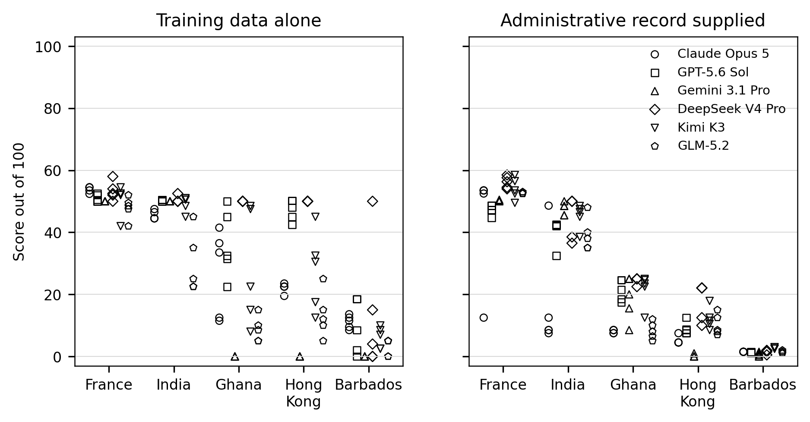
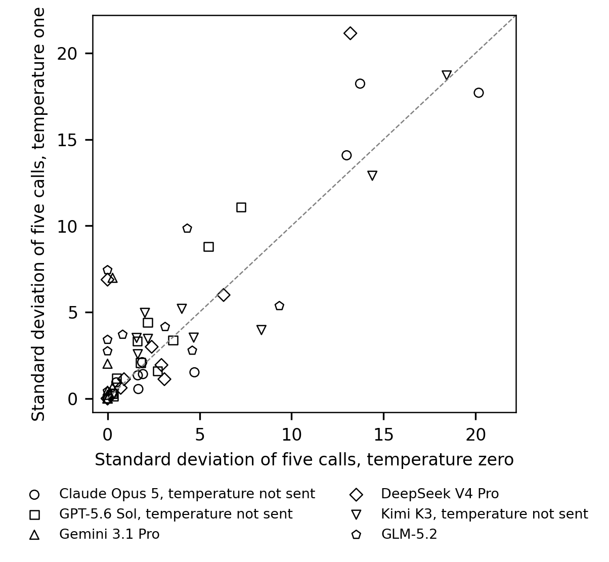
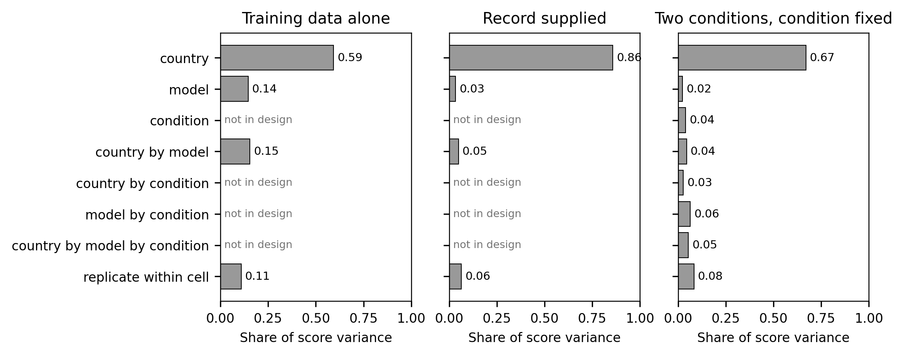
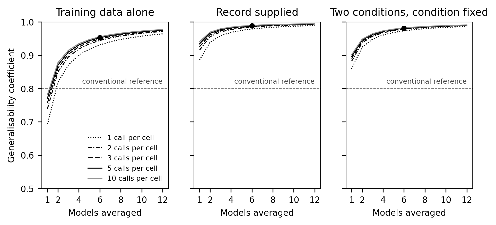

# Pilot analysis of Stage B

Written by `python -m analysis.pilot` from `runs/stage_b.jsonl` and `runs/stage_b_cap8000.jsonl`, with the cost of the batches read from `runs/stage_b.batches.jsonl`. The third pass of Stage A, the earlier pilot on Claude Haiku 4.5, is read from `runs/stage_a_v2.jsonl` for comparison alone. The program writes the file again on every run, so no figure below is typed by hand, and `README.md` in the same folder describes every table and figure the program writes.

Every figure below is a pilot figure on five countries, France, India, Ghana, Hong Kong and Barbados, and no confirmatory analysis uses any of the figures. Stage B asked the six confirmatory models to score the five countries under the two conditions, training data alone and the administrative record supplied in the prompt, at temperature zero and at temperature one, with five calls for every country, model, condition and temperature, under the holistic wording at instrument version v2. A cell below means the five calls of one country, model, condition and temperature. Stage C, the confirmatory run, asks the same models to score every country of the study. The scores of Gemini 3.1 Pro, DeepSeek V4 Pro and Kimi K3 come from `runs/stage_b_cap8000.jsonl`, where the three models were sent again at the output cap of 8,000 tokens which Stage C uses, and the scores of Claude Opus 5, GPT-5.6 Sol and GLM-5.2 come from `runs/stage_b.jsonl`. All 600 scores used pass every check of `analysis/pilot.py`.

## 1. Cost per call (section 7.2.1)

The listed cost per call prices the mean input and output tokens the provider recorded over the 100 calls of a model in Stage B at the listed price per million tokens which `scoring/config.py` holds for the route of the model. The table gives the cost of 1,000 calls in US dollars under each condition and under the two conditions together, with the token counts as means per call. The charged cost is the cost reported by OpenRouter, the service which passes every call of the six models to the provider. On the sync route OpenRouter reports the cost of every call, and the table gives the mean. On the batch route OpenRouter reports the cost of a whole batch, so a charged cost exists for the two conditions together alone, as the cost of the closed batches divided by the requests answered. The study scores with one instrument, the holistic wording which section 4.4 of PLAN.md fixed, so cost by instrument has one level, and `scoring/config.py` pins every confirmatory model to one endpoint, so cost by model is cost by provider.

| Model | Condition | Route | Input tokens | Output tokens | Reasoning tokens | Listed USD per 1,000 calls | Charged USD per 1,000 calls |
|---|---|---|---|---|---|---|---|
| Claude Opus 5 | training data alone | batch | 415.2 | 236.5 | 123.0 | 3.99 |  |
| Claude Opus 5 | record supplied | batch | 1,130.6 | 129.8 | 25.9 | 4.45 |  |
| Claude Opus 5 | two conditions | batch | 772.9 | 183.2 | 74.4 | 4.22 | 4.22 |
| GPT-5.6 Sol | training data alone | batch | 294.2 | 301.9 | 235.5 | 3.61 |  |
| GPT-5.6 Sol | record supplied | batch | 742.0 | 179.4 | 116.4 | 3.28 |  |
| GPT-5.6 Sol | two conditions | batch | 518.1 | 240.6 | 176.0 | 3.44 | 1.72 |
| Gemini 3.1 Pro | training data alone | sync | 296.2 | 1,032.4 | 969.7 | 12.98 | 12.98 |
| Gemini 3.1 Pro | record supplied | sync | 798.8 | 1,085.9 | 1,017.5 | 14.63 | 14.63 |
| Gemini 3.1 Pro | two conditions | sync | 547.5 | 1,059.1 | 993.6 | 13.80 | 13.80 |
| DeepSeek V4 Pro | training data alone | sync | 368.2 | 1,777.6 | 1,719.9 | 7.53 | 3.60 |
| DeepSeek V4 Pro | record supplied | sync | 818.2 | 2,108.5 | 2,048.2 | 9.43 | 4.22 |
| DeepSeek V4 Pro | two conditions | sync | 593.2 | 1,943.0 | 1,884.0 | 8.48 | 3.91 |
| Kimi K3 | training data alone | sync | 380.2 | 1,133.8 | 1,049.5 | 18.15 | 17.53 |
| Kimi K3 | record supplied | sync | 829.4 | 899.2 | 810.8 | 15.98 | 14.11 |
| Kimi K3 | two conditions | sync | 604.8 | 1,016.5 | 930.1 | 17.06 | 15.82 |
| GLM-5.2 | training data alone | sync | 298.4 | 112.0 | 57.8 | 0.91 | 0.89 |
| GLM-5.2 | record supplied | sync | 748.4 | 424.5 | 362.0 | 2.92 | 2.78 |
| GLM-5.2 | two conditions | sync | 523.4 | 268.3 | 209.9 | 1.91 | 1.83 |

Under the two conditions together, the charged cost as a share of the listed cost was 100 per cent for Claude Opus 5, 50 per cent for GPT-5.6 Sol, 100 per cent for Gemini 3.1 Pro, 46 per cent for DeepSeek V4 Pro, 93 per cent for Kimi K3 and 96 per cent for GLM-5.2. The listing of GPT-5.6 Sol marks a discount of 0.5 on the batch route, and `scoring/config.py` never takes a discount the listing marks, so the file prices the batch route at the full price. `scoring/config.py` prices DeepSeek V4 Pro at the higher of the two prices the listing gives, the price of two blocks of hours on weekdays, and every call of DeepSeek V4 Pro used here was written on Saturday 2026-10-03.

## 2. Projected cost of the training condition in Stage C (section 7.2.2)

Stage C asks every confirmatory model to score 122 countries at temperature one, with five calls for every country under the two conditions, so a model receives 610 calls under the training condition and 610 under the record condition, and the six models receive 7,320 calls in all. The projection multiplies the calls of Stage C by the cost per call of measure one, in US dollars. The listed projection takes the calls of Stage B at both temperatures, and the projection from temperature one takes the calls at temperature one alone, the temperature of Stage C. The charged projection takes the rate OpenRouter charged in Stage B. The worst case prices every call at the mean input tokens of the model and at the full output cap.

| Model | Route | Output cap | Training, listed | Record, listed | Two conditions, listed | Two conditions, from temperature one | Two conditions, at the charged rate | Two conditions, worst case |
|---|---|---|---|---|---|---|---|---|
| Claude Opus 5 | batch | 1,500 | 2.44 | 2.71 | 5.15 | 5.11 | 5.15 | 25.23 |
| GPT-5.6 Sol | batch | 1,500 | 2.20 | 2.00 | 4.20 | 4.22 | 2.10 | 19.56 |
| Gemini 3.1 Pro | sync | 8,000 | 7.92 | 8.92 | 16.84 | 17.00 | 16.84 | 118.46 |
| DeepSeek V4 Pro | sync | 8,000 | 4.59 | 5.75 | 10.34 | 10.40 | 4.77 | 39.60 |
| Kimi K3 | sync | 8,000 | 11.07 | 9.75 | 20.82 | 18.41 | 19.30 | 148.61 |
| GLM-5.2 | sync | 8,000 | 0.56 | 1.78 | 2.33 | 2.25 | 2.24 | 43.84 |
| All six models |  |  | 28.77 | 30.91 | 59.68 | 57.38 | 50.40 | 395.31 |

The 3,660 scores of the training condition are projected at 28.77 dollars at listed prices. The two conditions together, 7,320 calls, are projected at 59.68 dollars at listed prices, at 57.38 dollars from the calls at temperature one alone and at 50.40 dollars at the rate charged in Stage B, and the worst case is 395.31 dollars.

## 3. Parse outcomes (section 7.2.3)

`scoring/parse.py` gives every answer an outcome out of six, namely `ok`, `json_absent`, `json_invalid`, `schema_violation`, `refusal` and `empty`. A call means one planned score, and an attempt means one request sent for the call, so a call sent again after a failure holds two attempts or more. The rate below is the share, in per cent, of the calls of a model whose first answered attempt fell under an outcome. The first answered attempt is counted because a later attempt exists only where an earlier attempt failed, so counting later attempts would understate failure. An attempt OpenRouter never answered is counted apart as a transport error. The table also gives the share of first answers which ended at the output cap.

| Ledger | Model | Output cap | Calls answered | `ok` | `json_absent` | `json_invalid` | `schema_violation` | `refusal` | `empty` | Ended at the cap | Transport error attempts | Scores used |
|---|---|---|---|---|---|---|---|---|---|---|---|---|
| `stage_b.jsonl` | Claude Opus 5 | 1,500 | 100 | 100 | 0 | 0 | 0 | 0 | 0 | 0 | 0 | yes |
| `stage_b.jsonl` | GPT-5.6 Sol | 1,500 | 100 | 100 | 0 | 0 | 0 | 0 | 0 | 0 | 0 | yes |
| `stage_b.jsonl` | Gemini 3.1 Pro | 1,500 | 100 | 93 | 7 | 0 | 0 | 0 | 0 | 7 | 0 | no |
| `stage_b.jsonl` | DeepSeek V4 Pro | 1,500 | 100 | 55 | 2 | 0 | 0 | 0 | 43 | 45 | 100 | no |
| `stage_b.jsonl` | Kimi K3 | 1,500 | 100 | 85 | 1 | 0 | 0 | 0 | 14 | 15 | 0 | no |
| `stage_b.jsonl` | GLM-5.2 | 1,500 | 100 | 100 | 0 | 0 | 0 | 0 | 0 | 0 | 0 | yes |
| `stage_b_cap8000.jsonl` | Gemini 3.1 Pro | 8,000 | 100 | 98 | 0 | 0 | 0 | 0 | 2 | 0 | 0 | yes |
| `stage_b_cap8000.jsonl` | DeepSeek V4 Pro | 8,000 | 100 | 100 | 0 | 0 | 0 | 0 | 0 | 0 | 0 | yes |
| `stage_b_cap8000.jsonl` | Kimi K3 | 8,000 | 100 | 100 | 0 | 0 | 0 | 0 | 0 | 0 | 0 | yes |

In the ledgers the scores come from, 598 of the 600 first answers are `ok`. Gemini 3.1 Pro gave two `empty` first answers, which ended with the stop reason `error`, and every call of Gemini 3.1 Pro was scored in the end. No first answer in either ledger is `json_invalid`, `schema_violation` or `refusal`. At the cap of 1,500 output tokens in `runs/stage_b.jsonl`, the first answer ended at the cap in seven calls of Gemini 3.1 Pro, 45 calls of DeepSeek V4 Pro and 15 calls of Kimi K3, and Gemini 3.1 Pro, DeepSeek V4 Pro and Kimi K3 were sent again at the cap of 8,000 in `runs/stage_b_cap8000.jsonl`. The 100 transport errors of DeepSeek V4 Pro in `runs/stage_b.jsonl` are answers with status 404 from OpenRouter, because the privacy setting of the OpenRouter account excluded every paid endpoint which may train on the request, the pinned endpoint of DeepSeek V4 Pro included.

## 4. Replicates at temperature zero and at temperature one (section 7.2.4)

Every model scored the five countries under the two conditions five times at temperature zero and five times at temperature one, so a model holds 10 cells at a temperature. The table counts the cells whose five calls gave the same score and the distinct scores among the 50 calls, and gives the standard deviation (SD) of the five calls of a cell, in points of the score, as a mean over the 10 cells and at the largest. Claude Opus 5, GPT-5.6 Sol and Kimi K3 take no temperature at the endpoints the harness pins, so every call of the three models ran at the default of the developer, and the two rows of the three models compare two runs at the same setting. Claude Haiku 4.5, the pilot model of Stage A, is shown for comparison.

| Stage | Model | Temperature | Temperature sent | Cells with five equal calls | Distinct scores | Mean SD | Largest SD |
|---|---|---|---|---|---|---|---|
| B | Claude Opus 5 | 0 | no | 1 | 24 | 5.92 | 20.17 |
| B | Claude Opus 5 | 1 | no | 1 | 22 | 5.79 | 18.23 |
| B | GPT-5.6 Sol | 0 | no | 0 | 28 | 2.57 | 7.25 |
| B | GPT-5.6 Sol | 1 | no | 0 | 30 | 3.62 | 11.08 |
| B | Gemini 3.1 Pro | 0 | yes | 8 | 6 | 0.05 | 0.27 |
| B | Gemini 3.1 Pro | 1 | yes | 5 | 14 | 1.03 | 6.99 |
| B | DeepSeek V4 Pro | 0 | yes | 3 | 18 | 2.95 | 13.19 |
| B | DeepSeek V4 Pro | 1 | yes | 2 | 22 | 4.18 | 21.15 |
| B | Kimi K3 | 0 | no | 0 | 36 | 5.77 | 18.43 |
| B | Kimi K3 | 1 | no | 0 | 33 | 5.90 | 18.70 |
| B | GLM-5.2 | 0 | yes | 4 | 15 | 2.25 | 9.34 |
| B | GLM-5.2 | 1 | yes | 0 | 27 | 4.01 | 9.84 |
| A | Claude Haiku 4.5 | 0 | yes | 7 | 10 | 0.60 | 2.74 |
| A | Claude Haiku 4.5 | 1 | yes | 2 | 23 | 3.29 | 5.88 |

No model of Stage B gave five equal calls in every cell at either temperature. The largest count of cells with five equal calls was eight of 10, for Gemini 3.1 Pro at temperature zero, and five of 10, for Gemini 3.1 Pro at temperature one. For Gemini 3.1 Pro, DeepSeek V4 Pro and GLM-5.2, the three models which take a temperature, the mean SD was 0.05, 2.95 and 2.25 points at temperature zero and 1.03, 4.18 and 4.01 points at temperature one, in the same order of models. For Claude Opus 5, GPT-5.6 Sol and Kimi K3, whose two runs share the default of the developer, the mean SD was 5.92, 2.57 and 5.77 points in the run labelled temperature zero and 5.79, 3.62 and 5.90 points in the run labelled temperature one, in the same order of models.

The holistic wording anchors the scale at 0, 50 and 100, and asks for a decimal part wherever a whole number would hide a difference between two countries. The table below counts, for every model, condition and temperature, the distinct scores among the 25 calls and the calls which returned 0, 50 or 100 exactly.

| Stage | Model | Condition | Temperature | Calls | Distinct scores | Calls at 0, 50 or 100 | Lowest | Highest |
|---|---|---|---|---|---|---|---|---|
| B | Claude Opus 5 | training data alone | 0 | 25 | 17 | 0 | 8.5 | 54.5 |
| B | Claude Opus 5 | training data alone | 1 | 25 | 17 | 0 | 8.5 | 54.5 |
| B | Claude Opus 5 | record supplied | 0 | 25 | 14 | 0 | 1.5 | 54.5 |
| B | Claude Opus 5 | record supplied | 1 | 25 | 8 | 0 | 1.5 | 53.5 |
| B | GPT-5.6 Sol | training data alone | 0 | 25 | 13 | 5 | 2.5 | 52 |
| B | GPT-5.6 Sol | training data alone | 1 | 25 | 15 | 6 | 0 | 52.5 |
| B | GPT-5.6 Sol | record supplied | 0 | 25 | 17 | 0 | 1.2 | 51.2 |
| B | GPT-5.6 Sol | record supplied | 1 | 25 | 19 | 0 | 1.2 | 48.6 |
| B | Gemini 3.1 Pro | training data alone | 0 | 25 | 2 | 25 | 0 | 50 |
| B | Gemini 3.1 Pro | training data alone | 1 | 25 | 2 | 25 | 0 | 50 |
| B | Gemini 3.1 Pro | record supplied | 0 | 25 | 6 | 12 | 0 | 50 |
| B | Gemini 3.1 Pro | record supplied | 1 | 25 | 14 | 9 | 0 | 50.5 |
| B | DeepSeek V4 Pro | training data alone | 0 | 25 | 4 | 21 | 20.5 | 55.5 |
| B | DeepSeek V4 Pro | training data alone | 1 | 25 | 8 | 18 | 0 | 58 |
| B | DeepSeek V4 Pro | record supplied | 0 | 25 | 16 | 6 | 0.5 | 57.5 |
| B | DeepSeek V4 Pro | record supplied | 1 | 25 | 16 | 3 | 0.5 | 58.5 |
| B | Kimi K3 | training data alone | 0 | 25 | 20 | 0 | 3.5 | 55.5 |
| B | Kimi K3 | training data alone | 1 | 25 | 20 | 0 | 2.5 | 54.5 |
| B | Kimi K3 | record supplied | 0 | 25 | 21 | 0 | 2 | 56.5 |
| B | Kimi K3 | record supplied | 1 | 25 | 21 | 0 | 2.5 | 58.5 |
| B | GLM-5.2 | training data alone | 0 | 25 | 8 | 3 | 5 | 50 |
| B | GLM-5.2 | training data alone | 1 | 25 | 15 | 2 | 0 | 52 |
| B | GLM-5.2 | record supplied | 0 | 25 | 9 | 0 | 1.5 | 53 |
| B | GLM-5.2 | record supplied | 1 | 25 | 18 | 0 | 1 | 53 |
| A | Claude Haiku 4.5 | training data alone | 0 | 25 | 7 | 0 | 5 | 38.5 |
| A | Claude Haiku 4.5 | training data alone | 1 | 25 | 15 | 0 | 5 | 42.5 |
| A | Claude Haiku 4.5 | record supplied | 0 | 25 | 4 | 0 | 2.5 | 42.3 |
| A | Claude Haiku 4.5 | record supplied | 1 | 25 | 12 | 0 | 2.5 | 42.5 |

At temperature one, more than half the calls returned an anchor score for Gemini 3.1 Pro under training data alone (25 of 25) and DeepSeek V4 Pro under training data alone (18 of 25). Every call of Gemini 3.1 Pro under training data alone, at both temperatures, returned 0 or 50. France and India received 50 in every call, and Ghana, Hong Kong and Barbados received 0 in every call.

The table below gives the five cells of Stage B with the largest SD at temperature one, with the five scores of every cell.

| Model | Country | Condition | Scores of the five calls | SD |
|---|---|---|---|---|
| DeepSeek V4 Pro | Barbados | training data alone | 0, 0, 15, 4, 50 | 21.15 |
| Kimi K3 | Ghana | training data alone | 48.5, 47.5, 15, 8, 22.5 | 18.70 |
| Claude Opus 5 | France | record supplied | 52.5, 53.5, 53.5, 53.5, 12.5 | 18.23 |
| Claude Opus 5 | India | record supplied | 8.5, 48.6, 8.5, 7.5, 12.5 | 17.70 |
| Claude Opus 5 | Ghana | training data alone | 36.5, 41.5, 11.5, 33.5, 12.5 | 14.08 |

Figure 1 shows every score of Stage B at temperature one, by country and model, under the two conditions. Figure 2 compares the SD of every cell of Stage B at temperature zero with the SD of the same cell at temperature one, and a cell above the dashed line varied more at temperature one.

## 5. Generalisability coefficient on pilot data alone (section 7.2.5)

Every figure in this section is a pilot figure on five countries, and no confirmatory analysis uses any of the figures. The section uses the calls at temperature one alone, the temperature of Stage C.

A generalisability study splits the variance of the scores into variance components. A facet is a source of variation the design names, here the model, the call and the condition, and the design gives a component to the country, to every facet and to every combination of factors. The country is the object of measurement, so variance between countries is the signal. The model is a random facet, because the six models stand in for any models, and the call is a random facet as well. A component which combines the country with the model or with the call changes the order of countries from one model or call to the next, and counts as error. The condition is a fixed facet, because the study names two conditions and asks about no other condition, so the component of the country by condition counts as signal. Three designs are estimated, the training condition alone and the record condition alone as countries by models, and the two conditions together as countries by models by fixed conditions, with the calls within cells in every design.

The generalisability coefficient, Eρ², is the share of the variance of averaged country scores which comes from differences between countries, when the scores are used to order countries. The dependability coefficient, Φ, is the same share when an averaged score places a country on the scale itself, so the components which shift every country alike, the main effect of the model and, in the design with two conditions, the model by condition, count as error as well, and Φ is never above Eρ². A coefficient is reported at three settings, six models with five calls per cell, the size of the data, one model with five calls per cell, and one model with one call, the size of a single score.

The 95 per cent interval is exact, from the F distribution on 20 and four degrees of freedom, and the Spearman-Brown formula converts the interval from six models to one model. No exact interval exists when the number of calls changes, and Φ has no interval. Five countries give four degrees of freedom between countries, so every interval is wide.

The table below gives every variance component in squared points of the score, with the share of the total variance of the design, and Figure 3 shows the shares. No estimate was negative, so no component was set to zero.

| Component | Training data alone, variance | Training data alone, share | Record supplied, variance | Record supplied, share | Two conditions, variance | Two conditions, share |
|---|---|---|---|---|---|---|
| country | 296.56 | 0.593 | 426.81 | 0.857 | 347.75 | 0.670 |
| model | 72.40 | 0.145 | 16.17 | 0.032 | 11.64 | 0.022 |
| condition | not in design |  | not in design |  | 20.06 | 0.039 |
| country by model | 77.26 | 0.154 | 23.76 | 0.048 | 22.84 | 0.044 |
| country by condition | not in design |  | not in design |  | 13.93 | 0.027 |
| model by condition | not in design |  | not in design |  | 32.64 | 0.063 |
| country by model by condition | not in design |  | not in design |  | 27.66 | 0.053 |
| replicate within cell | 54.27 | 0.108 | 31.43 | 0.063 | 42.85 | 0.082 |

The table below gives the coefficients of the three designs at the three settings.

| Design | Setting | Eρ² | 95 per cent interval | Φ |
|---|---|---|---|---|
| Training data alone | six models, five calls | 0.953 | 0.834 to 0.994 | 0.917 |
| Training data alone | one model, five calls | 0.771 | 0.456 to 0.968 | 0.649 |
| Training data alone | one model, one call | 0.693 | none | 0.593 |
| Record supplied | six models, five calls | 0.988 | 0.959 to 0.999 | 0.982 |
| Record supplied | one model, five calls | 0.934 | 0.797 to 0.992 | 0.902 |
| Record supplied | one model, one call | 0.886 | none | 0.857 |
| Two conditions | six models, five calls | 0.981 | 0.934 to 0.998 | 0.969 |
| Two conditions | one model, five calls | 0.896 | 0.701 to 0.987 | 0.837 |
| Two conditions | one model, one call | 0.859 | none | 0.805 |

> The Digital Minds Research Sprint found a share of 0.876 of the variance separating one model from another in the combination of the model, the prompt format and the outcome, so a design with one wording cannot estimate how much the wording contributes, and the coefficient the study reports is optimistic by an unknown amount.

The decision study projects Eρ² to other numbers of models and of calls per cell, with the condition held at the two conditions of the data in the third design. The table gives one call and five calls per cell, `d_study.csv` holds one, two, three, five and 10 calls, and Figure 4 plots every number of calls. The dashed line at 0.80 in Figure 4 marks a conventional reference alone and no target of the study, because item one of section 6.2 of PLAN.md has still to name the target of the decision study.

| Models | Training data alone, one call | Training data alone, five calls | Record supplied, one call | Record supplied, five calls | Two conditions, one call | Two conditions, five calls |
|---|---|---|---|---|---|---|
| 1 | 0.693 | 0.771 | 0.886 | 0.934 | 0.859 | 0.896 |
| 2 | 0.818 | 0.871 | 0.939 | 0.966 | 0.924 | 0.945 |
| 3 | 0.871 | 0.910 | 0.959 | 0.977 | 0.948 | 0.963 |
| 4 | 0.900 | 0.931 | 0.969 | 0.983 | 0.961 | 0.972 |
| 5 | 0.919 | 0.944 | 0.975 | 0.986 | 0.968 | 0.977 |
| 6 | 0.931 | 0.953 | 0.979 | 0.988 | 0.973 | 0.981 |
| 7 | 0.940 | 0.959 | 0.982 | 0.990 | 0.977 | 0.984 |
| 8 | 0.947 | 0.964 | 0.984 | 0.991 | 0.980 | 0.986 |
| 9 | 0.953 | 0.968 | 0.986 | 0.992 | 0.982 | 0.987 |
| 10 | 0.958 | 0.971 | 0.987 | 0.993 | 0.984 | 0.989 |
| 11 | 0.961 | 0.974 | 0.988 | 0.994 | 0.985 | 0.990 |
| 12 | 0.964 | 0.976 | 0.989 | 0.994 | 0.987 | 0.990 |

> The Digital Minds Research Sprint found a share of 0.876 of the variance separating one model from another in the combination of the model, the prompt format and the outcome, so a design with one wording cannot estimate how much the wording contributes, and the coefficient the study reports is optimistic by an unknown amount.

The reliability of one model as a measure of countries comes from a design of countries with five calls per country, for every model under every condition. The coefficient of the mean of five calls is one minus the ratio of the mean square between the calls of a country to the mean square between countries, with an exact interval from the F distribution on 20 and four degrees of freedom, and the Spearman-Brown formula converts the coefficient and the interval to one call. Claude Haiku 4.5, the pilot model of Stage A, is shown for comparison.

| Stage | Model | Condition | Mean of five calls | 95 per cent interval | One call | 95 per cent interval |
|---|---|---|---|---|---|---|
| B | Claude Opus 5 | training data alone | 0.973 | 0.904 to 0.997 | 0.877 | 0.653 to 0.984 |
| B | Claude Opus 5 | record supplied | 0.916 | 0.706 to 0.990 | 0.686 | 0.324 to 0.953 |
| B | GPT-5.6 Sol | training data alone | 0.972 | 0.901 to 0.997 | 0.874 | 0.647 to 0.984 |
| B | GPT-5.6 Sol | record supplied | 0.996 | 0.987 to 1.000 | 0.981 | 0.936 to 0.998 |
| B | Gemini 3.1 Pro | training data alone | 1.000 | the five calls agreed in every country, so no interval exists | 1.000 | none |
| B | Gemini 3.1 Pro | record supplied | 0.996 | 0.987 to 1.000 | 0.982 | 0.940 to 0.998 |
| B | DeepSeek V4 Pro | training data alone | 0.934 | 0.769 to 0.992 | 0.739 | 0.399 to 0.963 |
| B | DeepSeek V4 Pro | record supplied | 0.993 | 0.974 to 0.999 | 0.964 | 0.881 to 0.996 |
| B | Kimi K3 | training data alone | 0.934 | 0.767 to 0.992 | 0.738 | 0.397 to 0.962 |
| B | Kimi K3 | record supplied | 0.994 | 0.980 to 0.999 | 0.972 | 0.908 to 0.997 |
| B | GLM-5.2 | training data alone | 0.977 | 0.920 to 0.997 | 0.896 | 0.697 to 0.987 |
| B | GLM-5.2 | record supplied | 0.996 | 0.986 to 1.000 | 0.981 | 0.935 to 0.998 |
| A | Claude Haiku 4.5 | training data alone | 0.975 | 0.914 to 0.997 | 0.888 | 0.679 to 0.986 |
| A | Claude Haiku 4.5 | record supplied | 0.988 | 0.958 to 0.999 | 0.943 | 0.819 to 0.993 |

> The Digital Minds Research Sprint found a share of 0.876 of the variance separating one model from another in the combination of the model, the prompt format and the outcome, so a design with one wording cannot estimate how much the wording contributes, and the coefficient the study reports is optimistic by an unknown amount.

Every model was removed in turn, the components were estimated again from the five models which remain, and Eρ² was projected to six models and to one model with five calls per cell, so a row reads against the row with no model removed. Under training data alone, Eρ² at six models ran from 0.940, with Kimi K3 removed, to 0.968, with Gemini 3.1 Pro removed, against 0.953 with no model removed. Under the record supplied, Eρ² at six models ran from 0.986, with Kimi K3 removed, to 0.994, with Claude Opus 5 removed, against 0.988 with no model removed. Under the two conditions together, Eρ² at six models ran from 0.976, with Kimi K3 removed, to 0.987, with Gemini 3.1 Pro removed, against 0.981 with no model removed.

| Design | Model removed | Eρ², six models | Eρ², one model | Components set to zero |
|---|---|---|---|---|
| Training data alone | none | 0.953 | 0.771 | none |
| Training data alone | Claude Opus 5 | 0.943 | 0.734 | none |
| Training data alone | GPT-5.6 Sol | 0.954 | 0.777 | none |
| Training data alone | Gemini 3.1 Pro | 0.968 | 0.835 | none |
| Training data alone | DeepSeek V4 Pro | 0.964 | 0.817 | none |
| Training data alone | Kimi K3 | 0.940 | 0.724 | none |
| Training data alone | GLM-5.2 | 0.948 | 0.752 | none |
| Record supplied | none | 0.988 | 0.934 | none |
| Record supplied | Claude Opus 5 | 0.994 | 0.966 | none |
| Record supplied | GPT-5.6 Sol | 0.987 | 0.925 | none |
| Record supplied | Gemini 3.1 Pro | 0.989 | 0.940 | none |
| Record supplied | DeepSeek V4 Pro | 0.987 | 0.924 | none |
| Record supplied | Kimi K3 | 0.986 | 0.919 | none |
| Record supplied | GLM-5.2 | 0.987 | 0.929 | none |
| Two conditions | none | 0.981 | 0.896 | none |
| Two conditions | Claude Opus 5 | 0.981 | 0.894 | none |
| Two conditions | GPT-5.6 Sol | 0.981 | 0.894 | none |
| Two conditions | Gemini 3.1 Pro | 0.987 | 0.928 | none |
| Two conditions | DeepSeek V4 Pro | 0.983 | 0.907 | model |
| Two conditions | Kimi K3 | 0.976 | 0.873 | none |
| Two conditions | GLM-5.2 | 0.979 | 0.887 | none |

> The Digital Minds Research Sprint found a share of 0.876 of the variance separating one model from another in the combination of the model, the prompt format and the outcome, so a design with one wording cannot estimate how much the wording contributes, and the coefficient the study reports is optimistic by an unknown amount.
